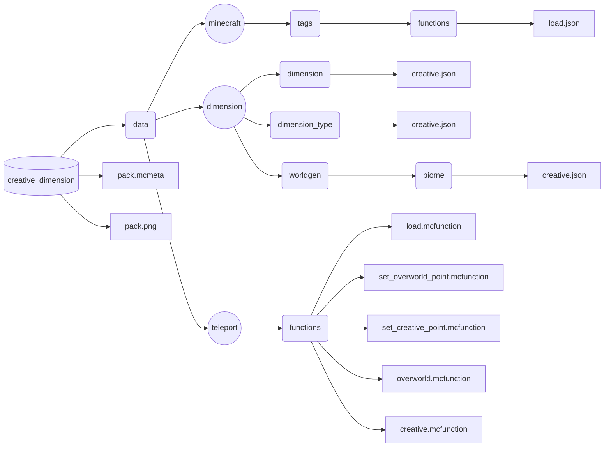

# Creative Dimension
This is a **minecraft datapack** that add a **flat creative dimension**.

## Command
### `/function teleport:load`

This function **load the datapack** and is **called automaticly** by the game when the datapack is added.

When the datapack is loaded, an **overworld point** and a **creative point** will be defined at the player's location in both of **minecraft:overworld** and **dimension:creative** dimension.

These two points are **always loaded** and defines the position where the player will be teleported when switching dimension.

### `/function teleport:set_overworld_point`

This function **set a new overworld point** and can only be called by a player in the dimension **minecraft:overworld**.

Please note that in order to set a new point, the command remove the last point, **remove all forceloaded chunk** inside the dimension (by using the minecraft command `/forceload remove all`) and **forceload** the chunk of the point.

### `/function teleport:set_creative_point`

This function **set a new creative point** and can only be called by a player in the dimension **dimension:creative**.

Please note that in order to set a new point, the command remove the last point, **remove all forceloaded chunk** inside the dimension (by using the minecraft command `/forceload remove all`) and **forceload** the chunk of the point.

### `/function teleport:overworld`

This function set the **nearest player** to **survival gamemode** and **teleport** him to the **overworld point** in the dimension **minecraft:overworld** if he is currently in the dimension **dimension:creative**.

### `/function teleport:creative`

This function set the **nearest player** to **creative gamemode** and **teleport** him to the **creative point** in the dimension **dimension:creative** if he is not **already in**.

# Structure of the datapack

