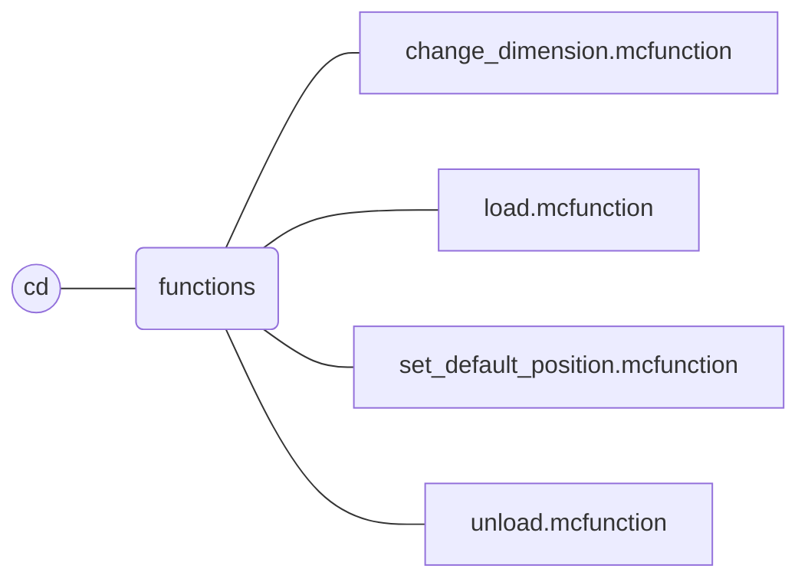
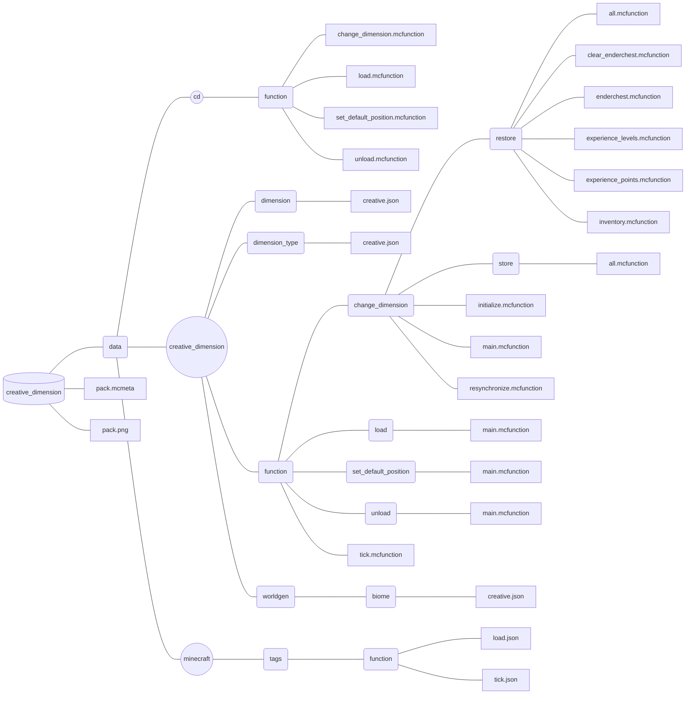

  

# Table of contents

- [**Description**](#description)
- [**In-game commands**](#in-game-commands)
  - [**Non-operator command**](#non-operator-command)
  - [**Operator commands**](#operator-commands)
- [**File structure**](#file-structure)
- [**Summary of versions and releases**](#summary-of-versions-and-releases)
  - [**Version status**](#version-status)
  - [**Release list**](#release-list)

 

# Description

**Creative Dimension** is a **Minecraft datapack** that add an **independant flat creative dimension** to your world.

This dimension is only composed of **one layer** of grass block at coordinate **Y = 0**. 
There is no **structures**, no **mobs**, no **rains**, no **day-night cycle** and a **constant ambient light**. 

In this dimension, each player has an **inventory**, an **enderchest inventory**, an **experience amount**, and a **gamemode** (default to creative) that is **distinct** from **the other basic dimensions** of the game.

 

# In-game commands

## Non-operator command
### `/trigger cd`

This command allows **any player** to **switch** between the **creative and other dimensions**.

Its sole purpose is to **provide access** to the cd:change_dimension function for **non-operator players**.
For more information, refer to the [description](#function-cdchange_dimension) of the *cd:change_dimension* function.

## Operator commands

> [!important]
> Please only use functions from the `cd` namespace. These are the functions **intended to be used by operators**.
> All functions in the `creative_dimension` namespace are internal and **must not be called directly**.

 

### `/function cd:change_dimension`

This command allows **any player** to **switch** between the **creative and other dimensions**.

When the function is called **by a player**, a **marker is summoned** in their current dimension at the chunk (0, 0). This marker **stores information** about the **player's main inventory, ender chest inventory, game mode, experience, and position**. Then, the player **retrieves data from their previous marker** and is therefore **teleported to the other dimension**.

If players switch dimensions **without using this function**, they will be resynchronized by retrieving data from their previous marker information, **without being teleported**. However, because no marker is created in their current dimension during the transition, the **next time** they switch dimensions **using the datapack**, the teleportation will use a **default position** instead of a saved location. For more information about how default positions work, refer to the [description](#function-cdset_default_position) of the cd:set_default_position function.

**New players** are assigned a default marker in the **creative dimension when they first join**, with **empty** inventories, **creative** gamemode, and **no experience** at their first connection.

 

### `/function cd:load`

This function **loads the datapack** and is **called automatically** by the game when the datapack is added or when the command `/reload` is used.

When the data pack is loaded, the **chunk at (0, 0)** is set to **always be loaded** in **each dimension**, an **armor stand** is summoned in the creative dimension and **two scoreboard objectives** are added.

> [!IMPORTANT]
> If you are using other datapacks that define **additional dimensions**, make sure to **force-load the chunk at (0, 0) in each of those dimensions** manually using `/execute in <dimension> run forceload add 0 0`.
> This is required for the datapack to function properly.

 

### `/function cd:set_default_position`

This function updates the **default teleportation position** based on the player's **current location and dimension**.

There are two default positions used by the datapack :
- The **creative default position**, initially set to coordinates (0, 0, 0)
- The **overworld  default position**, automatically initialized at the position of the first player processed by the datapack

These positions are useful when a player switches dimensions **outside the datapack system**, as the default position will be used for teleportation during their **next switch**.

 

### `/function cd:unload`

This function **unloads the datapack** and should be called **before uninstalling** it.

When the datapack is unloaded, all **chunks loaded, entities summoned, and scoreboard objectives created by the datapack** are permanently removed.

> [!WARNING]
> This action is **irreversible**. All saved player states (inventory, experience, etc.) will be deleted.
> **To avoid data loss**, make sure that **no players are currently in the creative dimension** before running this command.

 

# File structure

# Summary of versions and releases

## Version status

  <table>
    <thead>
      <tr>
        <th>Creative Dimension version</th>
        <th>Changes</th>
        <th>Retroactive</th>
        <th>Stable</th>
        <th>Datapack format supported</th>
      </tr>
    </thead>
    <tbody>
      <tr>
        <td>2.1</td>
        <td align = left>
          <ul>
              <li><strong>Added</strong> resynchronization system to the <code>change_dimension</code> function.</li>
              <li><strong>Added</strong> <code>set_default_position</code> function.</li>
          </ul>
        </td>
        <td>🟢</td>
        <td>🟢</td>
        <td>71, 80, 81</td>
      </tr>
      <tr>
        <td>2.0</td>
        <td align = left>
          <ul>
              <li><strong>Merged</strong> <code>dimension</code> and <code>teleport</code> namespaces into a new one named <code>creative_dimension</code>. <em>(breaking changes)</em></li>
              <li><strong>Added</strong> a new namespace <code>cd</code>.</li>
              <li><strong>Removed</strong> <code>set_overworld_point</code>, <code>set_creative_point</code>, <code>overworld</code> and <code>creative</code> functions</li>
              <li><strong>Added</strong> <code>unload</code> and <code>change_dimension</code> functions.</li>
          </ul>
        </td>
        <td>🔴</td>
        <td>🟡</td>
        <td>26, 41, 48, 57, 61, 71</td>
      </tr>
      <tr>
        <td>1.0</td>
        <td align = left>
          <ul>
            <li><strong>Created</strong> a flat dimension <code>creative</code>.</li>
            <li><strong>Created</strong> <code>load</code>, <code>set_overworld_point</code>, <code>set_creative_point</code>, <code>overworld</code> and <code>creative</code> functions.</li>
          </ul>
        </td>
        <td></td>
        <td>🔴</td>
        <td>26</td>
      </tr>
    </tbody>
  </table>

 

## Release list

  <table>
    <thead>
      <tr>
        <th>Minecraft version</th>
        <th>Datapack format</th>
        <th>Creative Dimension version</th>
        <th>Release</td>
      </tr>
    </thead>
    <tbody>
      <tr>
        <td>
          1.21.7
        </td>
        <td>81</td>
        <td>2.1</td>
        <td><a href = "https://github.com/Srymm/creative_dimension/releases/tag/2.1.81">Creative Dimension 2.1.81</a></td>
      </tr>
      <tr>
        <td>
          1.21.6
        </td>
        <td>80</td>
        <td>2.1</td>
        <td><a href = "https://github.com/Srymm/creative_dimension/releases/tag/2.1.80">Creative Dimension 2.1.80</a></td>
      </tr>
      <tr>
        <td rowspan = 2>
          1.21.5
        </td>
        <td rowspan = 2>71</td>
        <td>2.1</td>
        <td><a href = "https://github.com/Srymm/creative_dimension/releases/tag/2.1.71">Creative Dimension 2.1.71</a></td>
      </tr>
      <tr>
        <td>2.0</td>
        <td><a href = "https://github.com/Srymm/creative_dimension/releases/tag/2.0.71">Creative Dimension 2.0.71</a></td>
      </tr>
      <tr>
        <td>
          1.21.4
        </td>
        <td>61</td>
        <td>2.0</td>
        <td><a href = "https://github.com/Srymm/creative_dimension/releases/tag/2.0.61">Creative Dimension 2.0.61</a></td>
      </tr>
      <tr>
        <td>
          1.21.3 
          1.21.2
        </td>
        <td>57</td>
        <td>2.0</td>
        <td><a href = "https://github.com/Srymm/creative_dimension/releases/tag/2.0.57">Creative Dimension 2.0.57</a></td>
      </tr>
      <tr>
        <td>
          1.21.1 
          1.21
        </td>
        <td>48</td>
        <td>2.0</td>
        <td><a href = "https://github.com/Srymm/creative_dimension/releases/tag/2.0.48">Creative Dimension 2.0.48</a></td>
      </tr>
      <tr>
        <td>
          1.20.6 
          1.20.5
        </td>
        <td>41</td>
        <td>2.0</td>
        <td><a href = "https://github.com/Srymm/creative_dimension/releases/tag/2.0.41">Creative Dimension 2.0.41</a></td>
      </tr>
      <tr>
        <td rowspan = 2>
          1.20.4 
          1.20.3
        </td>
        <td rowspan = 2>26</td>
        <td>2.0</td>
        <td><a href = "https://github.com/Srymm/creative_dimension/releases/tag/2.0.26">Creative Dimension 2.0.26</a></td>
      </tr>
      <tr>
        <td>1.0</td>
        <td><a href = "https://github.com/Srymm/creative_dimension/releases/tag/1.0.26">Creative Dimension 1.0.26</a></td>
      </tr>
    </tbody>
  </table>

