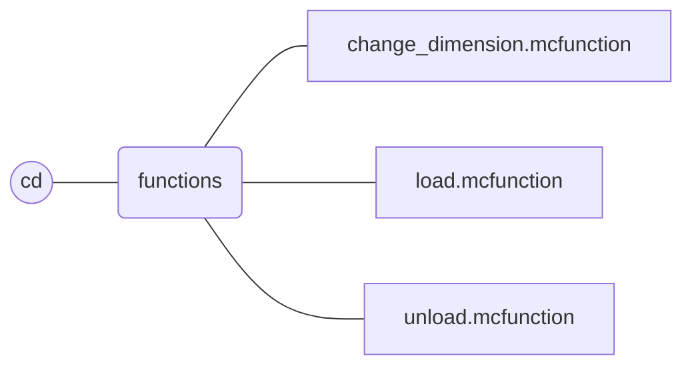

  

**Creative Dimension** is a **Minecraft datapack** that add an **independant flat creative dimension** to your world.

This dimension is only composed of **one layer** of grass block at coordinate **Y = 0**. 
There is no **structures**, no **mobs**, no **rains**, no **day-night cycle** and a **constant ambient light**. 

In this dimension, each player has an **inventory**, an **enderchest inventory**, an **experience amount**, and a **gamemode** (default to creative) that is **distinct** from **the other basic dimensions** of the game.

# In game commands

## Non-operator command
### `/trigger cd`

This command allows **every player** to **switch** between the **creative** and the **other dimensions**.

The purpose of this function is only to call the *cd:change_dimension* function as a **non-operator** player. If you need **more information**, please refer to the [description](#function-cdchange_dimension) of the *cd:change_dimension* function.

## Operator commands

Please note that all functions that **should be used** by an operator are under the *cd* namespace.

### `/function cd:change_dimension`

This command allows **every player** to **switch** between the **creative** and the **other dimensions**.

When this function is called **by a player**, a **marker is summoned** in his dimension at the chunk 0 0. The marker **contains information** about player inventory, enderchest inventory, gamemode, experience, and position.
After that, the player **retrieves the information from his previous marker** and is therefore teleported to the other dimension, recovering his inventory, enderchest inventory, experience and gamemode.

Players who call this function **for the first time** will be given a previous marker in the **creative dimension** with **empty** inventories, with **creative** gamemode, and with **no experience**.

> Please note that this function may **not work properly** if a player manages to **switch between the creative and other dimensions without using this datapack function**.

### `/function cd:load`

This function **loads the datapack** and is **called automatically** by the game when the datapack is added or when the command `/reload` is used.

When the data pack is loaded, the **chunk positioned at 0 0** is set to **always be loaded** in **each dimension**, an **armor stand** is summoned in the creative dimension and **two scoreboard objectives** are added.

> Please note that if you have other datapacks that **include dimensions**, it is important to **load the chunk at 0 0** (by using the command `/forceload add 0 0`) in those dimensions for the datapack to **work**.

### `/function cd:unload`

This function **unloads the datapack** and should be called **before uninstalling** the datapack.

When the data pack is unloaded, all chunks loaded, all entities summoned, all scoreboard objectives added **by this datapack** are **removed**.

# Structure of the datapack

