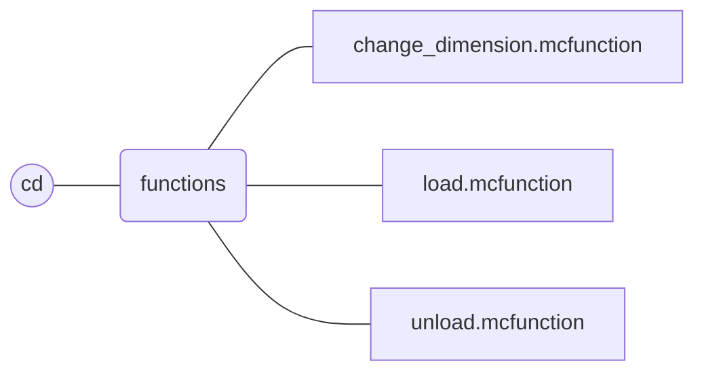
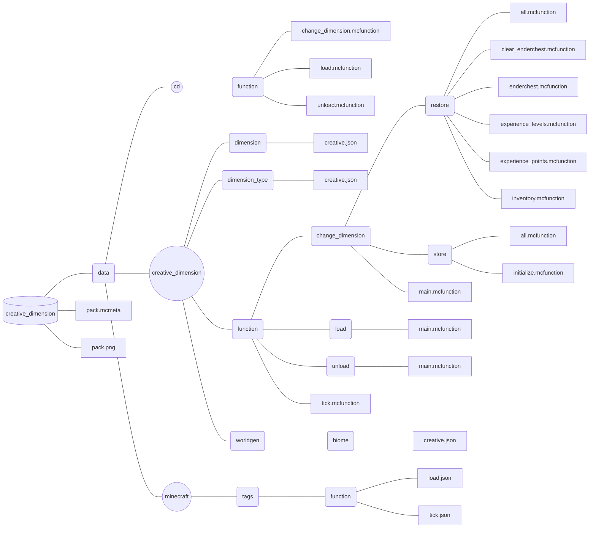

  

# Table of contents

- [**Description**](#description)
- [**In-game commands**](#in-game-commands)
  - [**Non-operator command**](#non-operator-command)
  - [**Operator commands**](#operator-commands)
- [**File structure**](#file-structure)
- [**Summary of versions and releases**](#summary-of-versions-and-releases)
  - [**Version status**](#version-status)
  - [**Release list**](#release-list)

 

# Description

**Creative Dimension** is a **Minecraft datapack** that add an **independant flat creative dimension** to your world.

This dimension is only composed of **one layer** of grass block at coordinate **Y = 0**. 
There is no **structures**, no **mobs**, no **rains**, no **day-night cycle** and a **constant ambient light**. 

In this dimension, each player has an **inventory**, an **enderchest inventory**, an **experience amount**, and a **gamemode** (default to creative) that is **distinct** from **the other basic dimensions** of the game.

 

# In-game commands

## Non-operator command
### `/trigger cd`

This command allows **every player** to **switch** between the **creative** and the **other dimensions**.

The purpose of this command is only to call the *cd:change_dimension* function as a **non-operator** player. If you need **more information**, please refer to the [description](#function-cdchange_dimension) of the *cd:change_dimension* function.

 

## Operator commands

> [!note]
> Please note that all functions that **should be used** by an operator are under the *cd* namespace.

 

### `/function cd:change_dimension`

This command allows **every player** to **switch** between the **creative** and the **other dimensions**.

When this function is called **by a player**, a **marker is summoned** in his dimension at the chunk 0 0. The marker **contains information** about player inventory, enderchest inventory, gamemode, experience, and position.
After that, the player **retrieves the information from his previous marker** and is therefore teleported to the other dimension, recovering his inventory, enderchest inventory, experience and gamemode.

Players who call this function **for the first time** will be given a previous marker in the **creative dimension** with **empty** inventories, with **creative** gamemode, and with **no experience**.

> [!warning]
> Please note that this function may **not work properly** if a player manages to **switch between the creative and other dimensions without using this datapack function**.

 

### `/function cd:load`

This function **loads the datapack** and is **called automatically** by the game when the datapack is added or when the command `/reload` is used.

When the data pack is loaded, the **chunk positioned at 0 0** is set to **always be loaded** in **each dimension**, an **armor stand** is summoned in the creative dimension and **two scoreboard objectives** are added.

> [!IMPORTANT]
> Please note that if you have other datapacks that **include dimensions**, it is important to **load the chunk at 0 0** in those dimensions (by using the command `/forceload add 0 0`) for the datapack to **work**.

 

### `/function cd:unload`

This function **unloads the datapack** and should be called **before uninstalling** the datapack.

When the data pack is unloaded, all chunks loaded, all entities summoned, all scoreboard objectives added **by this datapack** are **removed**.

 

# File structure

# Summary of versions and releases

## Version status

  <table>
    <thead>
      <tr>
        <th>Creative Dimension version</th>
        <th>Changes</th>
        <th>Retroactive</th>
        <th>Stable</th>
        <th>Datapack format supported</th>
      </tr>
    </thead>
    <tbody>
      <tr>
        <td>2.0</td>
        <td align = left>
          <ul>
              <li><strong>Merged</strong> <code>dimension</code> and <code>teleport</code> namespaces into a new one named <code>creative_dimension</code>. <em>(breaking changes)</em></li>
              <li><strong>Added</strong> a new namespace <code>cd</code>.</li>
              <li><strong>Removed</strong> <code>set_overworld_point</code>, <code>set_creative_point</code>, <code>overworld</code> and <code>creative</code> functions</li>
              <li><strong>Added</strong> <code>unload</code> and <code>change_dimension</code> functions.</li>
          </ul>
        </td>
        <td>🔴</td>
        <td>🟢</td>
        <td>26, 41, 48</td>
      </tr>
      <tr>
        <td>1.0</td>
        <td align = left>
          <ul>
            <li><strong>Created</strong> a flat dimension <code>creative</code>.</li>
            <li><strong>Created</strong> <code>load</code>, <code>set_overworld_point</code>, <code>set_creative_point</code>, <code>overworld</code> and <code>creative</code> functions.</li>
          </ul>
        </td>
        <td></td>
        <td>🔴</td>
        <td>26</td>
      </tr>
    </tbody>
  </table>

 

## Release list

  <table>
    <thead>
      <tr>
        <th>Minecraft version</th>
        <th>Datapack format</th>
        <th>Creative Dimension version</th>
        <th>Release</td>
      </tr>
    </thead>
    <tbody>
      <tr>
        <td>1.21</td>
        <td>48</td>
        <td>2.0</td>
        <td><a href = "https://github.com/Srymm/creative_dimension/releases/tag/2.0.48">Creative Dimension 2.0.48</a></td>
      </tr>
      <tr>
        <td>
          1.20.6 
          1.20.5
        </td>
        <td>41</td>
        <td>2.0</td>
        <td><a href = "https://github.com/Srymm/creative_dimension/releases/tag/2.0.41">Creative Dimension 2.0.41</a></td>
      </tr>
      <tr>
        <td rowspan = 2>
          1.20.4 
          1.20.3
        </td>
        <td rowspan = 2>26</td>
        <td>2.0</td>
        <td><a href = "https://github.com/Srymm/creative_dimension/releases/tag/2.0.26">Creative Dimension 2.0.26</a></td>
      </tr>
      <tr>
        <td>1.0</td>
        <td><a href = "https://github.com/Srymm/creative_dimension/releases/tag/1.0.26">Creative Dimension 1.0.26</a></td>
      </tr>
    </tbody>
  </table>

